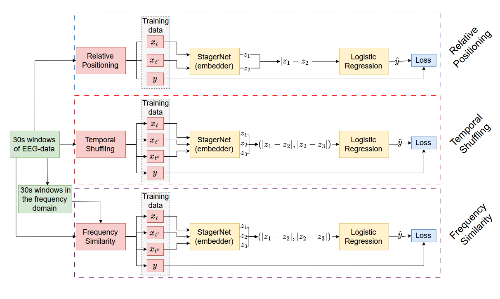
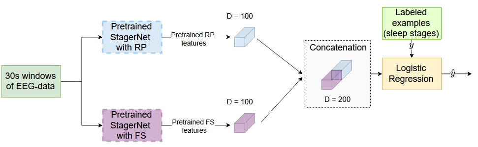
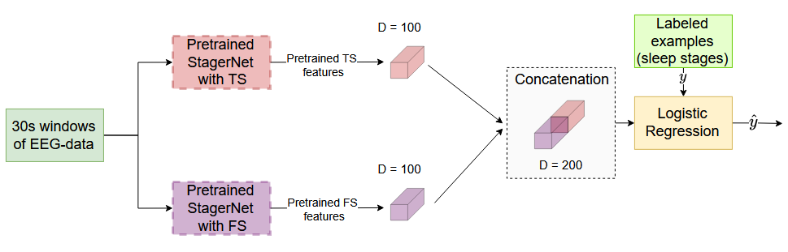

# A novel dual-stream time-frequency contrastive pretext tasks framework for sleep stage classification
This repository contains the implementation of the paper "A novel dual-stream time-frequency contrastive pretext tasks framework for sleep stage classification". In this project we aim at introducing a dual-stream pretext task architecture that operates both in the time and frequency domains. In particular, we have examined the incorporation of the novel Frequency Similarity (FS) pretext task into two existing pretext tasks, Relative Positioning (RP) and Temporal Shuffling (TS). The original paper can be found at: [https://arxiv.org/pdf/2312.09623.pdf](https://arxiv.org/pdf/2312.09623.pdf).   
Below the architecture for pre-training utilized in the paper is shown



Below the Dual-stream time-frequency framework with RP/TS and FS for the downstream task is shown.





This is tested on the downstream task sleep staging. A significant improvement in the accuracy of the downstream task was found for both pretext tasks with the assistance of the proposed pretext task. 
## Data
The dataset used in this paper is a subset of the Physionet Challenge 2018 EEG dataset, specifically the 994 participants from the training set with available sleep annotations. You can access the dataset at the following link: <a href="https://archive.physionet.org/physiobank/database/challenge/2018/">Physionet Challenge 2018 EEG dataset<a>. Please download the complete training dataset. Ensure that the path to your loaded data is specified in the [`utils/datasets.py`](utils/datasets.py) file.
## Dependencies
Python 3.8.6 has been utilized for this project.
Install the required Python packages using the following command:

```bash
$ pip install -r requirements.txt
```

## Training and testing
For end-to-end training and testing, you can use the [`main.py`](main.py) script, which combines the embeddings of RP and FS. The RP and FS pretext tasks are located in the pretext_tasks directory. In the [`combining_emb.py`](combining_emb.py) file, these features can be combined and provided as input for the downstream task, as well as for generating UMAP visualizations. The utilization of the stored models instead of training the model is also possible, and can be achieved in the [`pretext_tasks/RP.py`](pretext_tasks/RP.py) and [`pretext_tasks/similari_pick.py`](pretext_tasks/similari_pick.py) files respectively.

## Contact

If you have any questions or need further assistance, please don't hesitate to reach out via email:
-    Sergio Kazatzidis: s.kazatzidis@gmail.com
-    Siamak Mehrkanoon: s.mehrkanoon@uu.nl


